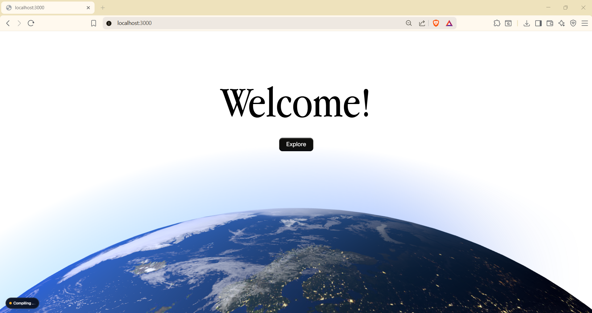
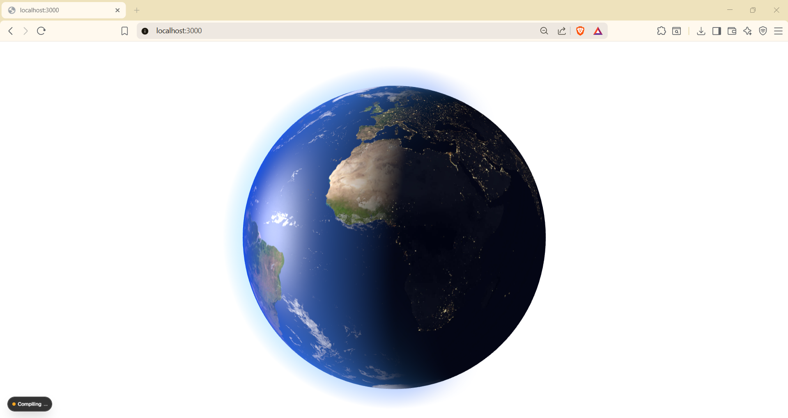

# 3D Planet Hero

An animated 3D Earth rendered with custom GLSL shaders, embedded in a Next.js landing-page hero.

<video src="images/video.mp4" controls width="100%"></video>

> The video above shows the scroll-driven planet animation. If it doesn't render here, the file is at [`images/video.mp4`](images/video.mp4).



## Credit

This is my walk-through of [**"Build an Awwwards Winning 3D Website | Next.js, three.js, GSAP"**](https://www.youtube.com/watch?v=RdyZnB6ElLs) — I followed the tutorial to learn how to combine Next.js with raw Three.js, GLSL shaders, and GSAP scroll animation. The structure and shader approach are from the tutorial; I adapted it to **Next.js 16 (app router)** and **TypeScript**, and I'm using it here as a portfolio of what I picked up.

## What's in it

- **Custom Earth shader** — day/night terminator using `day.jpg`, `night.jpg`, and `specularClouds.jpg` textures sampled in the fragment shader.
- **Atmosphere shader** — a separate vertex/fragment pair drawing a soft outward glow around the sphere.
- **Scroll-driven animation** — GSAP `ScrollTrigger` ties the camera and planet rotation to scroll position.
- **Next.js 16 app router** — `app/page.tsx` mounts a `<canvas class="planet-3D">` and a small `useEffect` boots the Three.js scene.
- **Local fonts** — Inter Variable + Apple Garamond, loaded through `next/font/local`.



## Stack

- Next.js 16, React 19, TypeScript
- Three.js (raw — not `react-three-fiber` for this scene)
- GSAP + ScrollTrigger
- TailwindCSS 4
- GLSL shaders loaded via `raw-loader`

## Run it

```bash
npm install
npm run dev
```

Open <http://localhost:3000>.

## Layout

```
app/
├── layout.tsx              # Root layout, font loading
├── page.tsx                # Hero section, mounts the planet canvas
├── global.css
└── pages/about.tsx
components/
└── 3D/
    ├── planet.ts           # Three.js scene + render loop + GSAP timeline
    └── shaders/
        ├── earth/          # vertex.glsl, fragment.glsl
        └── atmosphere/     # vertex.glsl, fragment.glsl
public/
├── earth/                  # day.jpg, night.jpg, specularClouds.jpg
└── fonts/                  # Inter, Apple Garamond
styles/main.css
```

## Notes

- The Three.js scene runs entirely client-side (`'use client'`); the page is otherwise statically rendered.
- Pixel ratio and viewport size are read once on mount; the scene doesn't currently resize on window resize — that's the obvious next thing to add.
